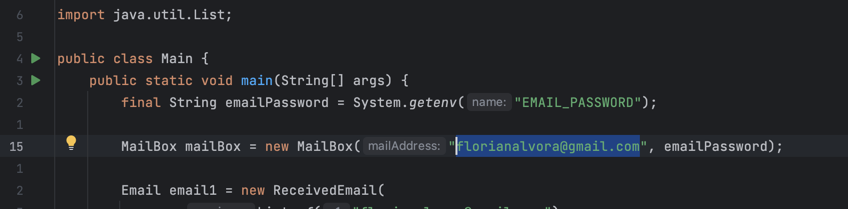

# JAVA GMAIL
A quick Java application to create and send emails using the Gmail SMTP server.

## ⚡️ Features

- Ability to send an Email with your Gmail mailbox
- Option to mark an email as favorite or important
- Verification of the recipient's email address validity (ex: mail@domain.com )

## 🆕 Features to add

- Connect to the Gmail mailbox
  - Retrieve emails received on the mailbox
  - Edit the status of emails in the mailbox
- Add a visual interface

## 🧠 UML diagram

Before starting to code this application, I decided to create a UML diagram to organize my work and structure my ideas.

You can access this diagram [here](https://github.com/florian-alb/JavaGmail/blob/main/Readme/uml_diagram.pdf).

## 💻 Requirements

- Java 8 or newer
- Apache Maven 4.0 or newer
- A Gmail account

## 🛠️ Installation

#### With Github :

```bash
git clone https://github.com/florian-alb/JavaGmail
```

To use this program with your email address, please follow these steps:

1. In the main method, update the email in the MailBox constructor with your email address.


2. Set a new Gmail application password: [instructions here](https://support.google.com/mail/answer/185833?hl)

3. Set a new environment variable ```EMAIL_PASSWORD``` that contains your password or application password.

4. Run the program and enjoy 😎

<sup>**🥷 Privacy First:** do not use your Gmail password directly in your program. Use an environment variable.</sup>

## ☕️ Java doc

You can view the Java doc in the file ```target/site/apidocs/index.html``` and update it using the following command in the application root :

```bash
mvn javadoc:javadoc
```

## 🤓 Author
ALBORA Florian